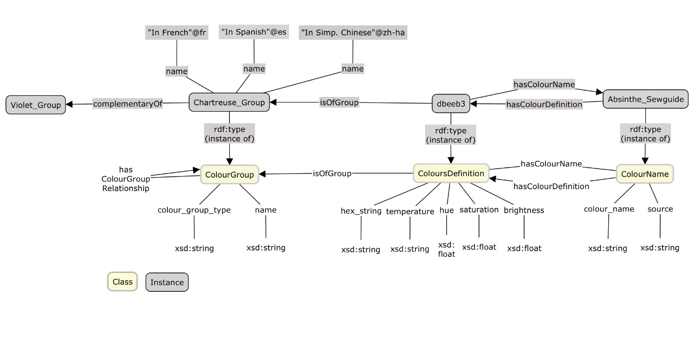

# FTP - Colour Ontology

<!-- PROJECT LOGO -->
 

  

  <h3 align="center">Colour Ontology for FTP</h3>

  

    An awesome ontology model for colours in the fashion industry
     
    <a href="https://github.com/zishanqin/FTP---Colour-Ontology/index.html"><strong>Our formal website »</strong></a>
  

<!-- ABOUT THE PROJECT -->
## About The Project
Colour is one of the most important visual features in the fashion industry. Currently, computer vision is being applied to fashion much more than before. When we do a fashion trend prediction, the lack of a consistent and comprehensive vocabulary that captures experts’ knowledge in fashion colours can create significant obstacles for researchers thus hindering the development of fashion trend prediction. In this study, we propose an approach that maps visual features-more closely to how they are thought about and used in the fashion world. We construct an ontology, following W3C Semantic Web standards, that captures the relevant concepts of colour in the fashion industry, including the basic vocabulary of colours along with its classifications, attributes, and important relationships. 

  

(<a href="#top">back to top</a>)

<!-- CONTRIBUTING -->
## Contributing

Contributions are what make the open source community such an amazing place to learn, inspire, and create. Any contributions you make are **greatly appreciated**.

If you have a suggestion that would make this better, please send a message to our [forum](https://groups.google.com/g/colour-ontology-for-ftp?pli=1). Don't forget to give the project a star! Thanks!

(<a href="#top">back to top</a>)

<!-- LICENSE -->
## License

Distributed under the MIT License. See `LICENSE.txt` for more information.

(<a href="#top">back to top</a>)

<!-- CONTACT -->
## Contact

Zishan (Taylor) Qin - [@zishanqin](https://github.com/zishanqin) - taylorqin1999@icloud.com

Sergio Jose Rodriguez Mendez - [@srodriguez142857](https://w3id.org/people/sergio) - sergio.rodriguezmendez@anu.edu.au

Priscilla Kan John - [@priscillakj](https://comp.anu.edu.au/people/priscilla-kan-john) - priscilla.kanjohn@anu.edu.au

Project Link: [https://github.com/zishanqin/FTP---Colour-Ontology](https://github.com/zishanqin/FTP---Colour-Ontology)

(<a href="#top">back to top</a>)

<!-- ACKNOWLEDGMENTS -->
## Acknowledgments

[Best-README-Template](https://github.com/othneildrew/Best-README-Template)

[Webthemez](http://webthemez.com)

[Bootstrap](http://getbootstrap.com)

[Flaticon](https://www.flaticon.com/search?word=fashion)
