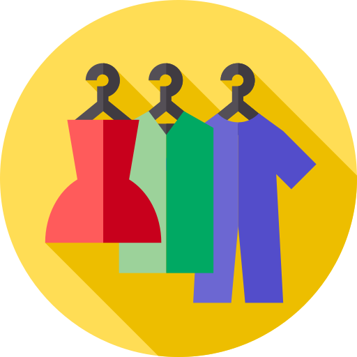

# FTP - Colour Ontology

<!-- PROJECT LOGO -->
 

  

  <h3 align="center">Colour Ontology for FTP</h3>

  

    An awesome ontology model for colours in the fashion industry
     
    <a href="https://Fashion-Trend-Prediction.github.io"><strong>Our formal website »</strong></a>
  

<!-- ABOUT THE PROJECT -->
## About The Project
Colour is an important visual cue in fashion. Currently, computer vision is being applied to fashion much more than before. The lack
of a consistent, comprehensive vocabulary and relevant relationships to capture expert knowledge in fashion colour can severely hamper the work
of computer researchers, thus hindering the development of fashion trend prediction. In this study, we propose an ontology that maps colour more
closely to how they are viewed and used in the fashion world. Following W3C Semantic Web standards, it captures relevant concepts of colour in
the fashion industry, including the basic vocabulary of colours with its classifications, attributes, and important relationships.

  

Quick access to our vocabulary: <a href="files/vocabulary.csv" download>Download the vocabulary</a>. 

Quick access to our ontology RDF/Turtle file: <a href="files/ontology.ttl" download>Download the ontology</a>. 

(<a href="#top">back to top</a>)

<!-- CONTRIBUTING -->
## Contributing

Contributions are what make the open source community such an amazing place to learn, inspire, and create. Any contributions you make are **greatly appreciated**.

If you have a suggestion that would make this better, please send a message to our [forum](https://groups.google.com/g/colour-ontology-for-ftp?pli=1). Don't forget to give the project a star! Thanks!

(<a href="#top">back to top</a>)

<!-- LICENSE -->
## License

Distributed under the MIT License. See `LICENSE.txt` for more information.

(<a href="#top">back to top</a>)

<!-- CONTACT -->
## Contact

Zishan (Taylor) Qin - [@zishanqin](https://github.com/zishanqin) - taylorqin1999@icloud.com

Sergio José Rodríguez Méndez - [@srodriguez142857](https://w3id.org/people/sergio) - Sergio.RodriguezMendez@anu.edu.au

Priscilla Kan John - [@priscillakj](https://comp.anu.edu.au/people/priscilla-kan-john) - priscilla.kanjohn@anu.edu.au

Project Link: [https://github.com/Fashion-Trend-Prediction/Colour-Ontology](https://github.com/Fashion-Trend-Prediction/Colour-Ontology)

(<a href="#top">back to top</a>)

<!-- ACKNOWLEDGMENTS -->
## Acknowledgments

README Template Credit - [Best-README-Template](https://github.com/othneildrew/Best-README-Template)

Website Template Credit - [Webthemez](http://webthemez.com)

Website Template Credit - [Bootstrap](http://getbootstrap.com)

Logo - [Flaticon](https://www.flaticon.com/search?word=fashion)
